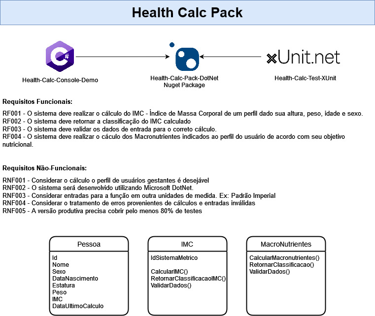

# health-calc-pack-dotnet

### Curso de Pós-Graduação em Engenharia de Software da PUC-MG

### Projeto apresentado à disciplina _Projeto Integrado em Engenharia de Software_

Uma biblioteca que permite cálculo de IMC e Macronutrientes, baseados nos dados inseridos pelo usuário.

# Projeto

# IMC

IMC = Peso (em kg) dividido pela altura (em centímetros) ao quadrado ( peso/altura²)

Classifição:

- Menor que 18.5 - Abaixo do peso
- Entre 18.5 e 24.9 - Peso normal
- Entre 25.0 e 29.9 - Pré-obesidade
- Entre 30.0 e 34.9 - Obesidade Grau 1
- Entre 35.0 e 39.9 - Obesidade Grau 2
- Acima de 40 - Obesidade Grau 3

# Macronutrientes

Os macronutrientes serão calculados baseados nos seguintes parâmetros e regras:

- Sexo

  - Reduzir em 20% os resultados para sexo feminino

- Peso em Kg

  - O peso informado deve ser >= 35 kg

- Nível de Atividade:

  - Sedentário
  - Moderadamente Ativo
  - Bastante Ativo
  - Extremamente Ativo

- Objetivo:

  - Bulking (Aumento de Peso):

    - Proteína: 2g por Kg
    - Gordura: 2g por Kg
    - Carboidrato:
      - 4g por Kg (metabolismo lento e rotina mais cedentária)
      - 7g por Kg (metabolismo acelerado e rotina de exercícios)

  - Cutting (Perda de Peso)

    - Proteína: 2g por Kg
    - Gordura: 1g por Kg
    - Carboidrato: 2g por Kg

  - Manter o Peso

    - Proteína: 2g por Kg
    - Gordura: 1g por Kg
    - Carboidrato: 5g por Kg

# Tecnologias Utilizadas

- IDE

  - [Visual Studio](https://visualstudio.microsoft.com/pt-br/downloads/)

- Framework

  - [.NET 6.0](https://dotnet.microsoft.com/en-us/download/dotnet/thank-you/sdk-6.0.403-windows-x64-installer)

- Testing

  - [XUnit.net](https://xunit.net/)

- Distribuição

  - [NuGet](https://www.nuget.org/)

# Exemplo

Exemplo de cálculo de IMC e Macronutrientes, utilizando a aplicação console para teste de uso da biblioteca.

# Pontos para Evolução

- Considerar gravidez para os cálculos de IMC e Macronutrientes
- Cálculos mais detalhados dos Macronutrientes (como levar em consideração a taxa de metabolismo basal, que pode ser estimada por outras fórmulas)

# Como utilizar

Instalar a [biblioteca](https://www.nuget.org/packages/health-calc-pack-dotnet-bbt-pies) através de qualquer um dos métodos listados no link.

Criar uma nova instância das classes que darão acesso as funções:

- BMI (classe para o IMC)

  - Calc (realiza o cálculo do IMC)
  - GetBMIClass (Retorna a categoria de peso, dado um IMC)

- Macronutrients (Classe para cálculo de macronutrientes)
  - Calc (realiza o cálculo do consumo diário de macronutrientes)

Uma aplicação console de exemplo foi desenvolvida para demonstração de
[utilização](https://github.com/bernardobt/health-calc-pack-dotnet/blob/main/src/health-calc-dotnet/health-calc-console-dotnet/Program.cs).
